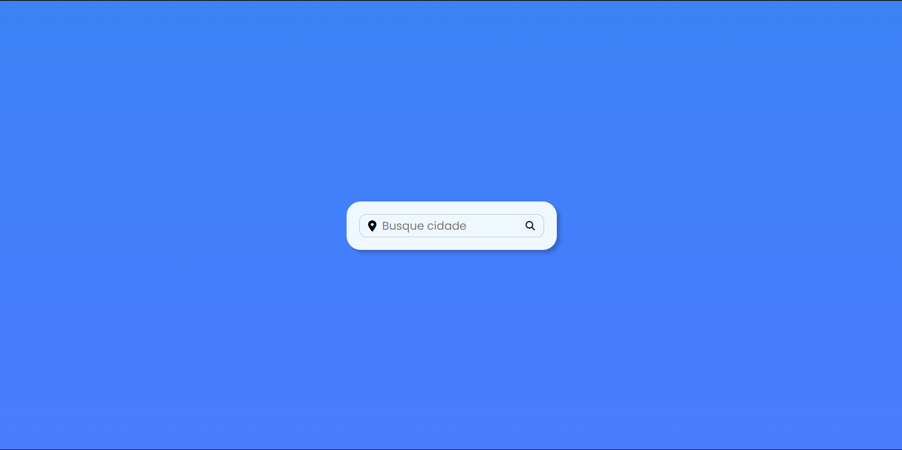
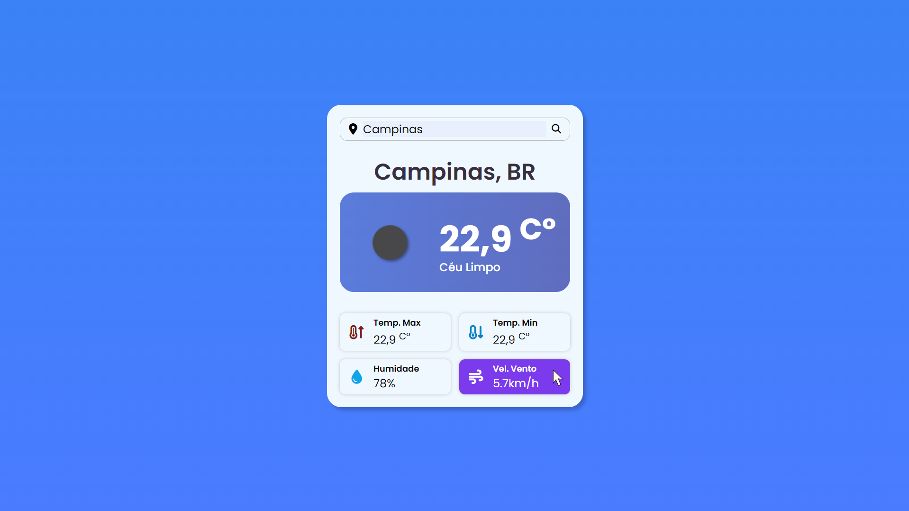
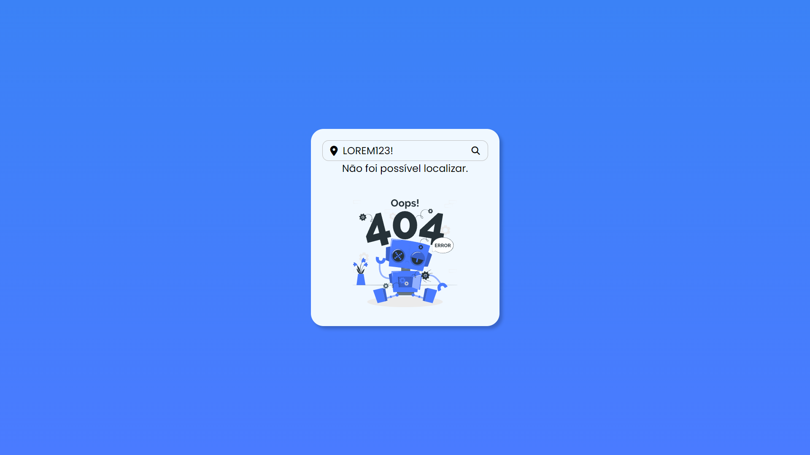

# Weather App
Durante meus estudos de HTML, CSS e Javascript, desenvolvi este projeto que utiliza as três linguagens para criar um Weather App funcional e visualmente atraente. Iintegrei a API [OpenWeatherMap](https://openweathermap.org/) para garantir dados precisos e atualizados sobre o clima em diferentes cidades.

